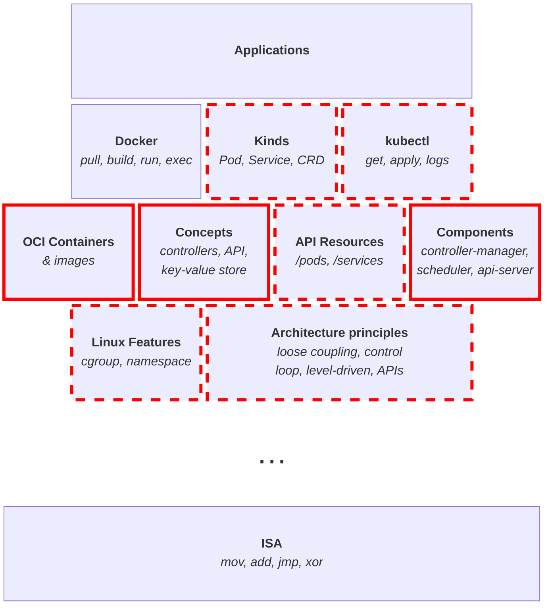
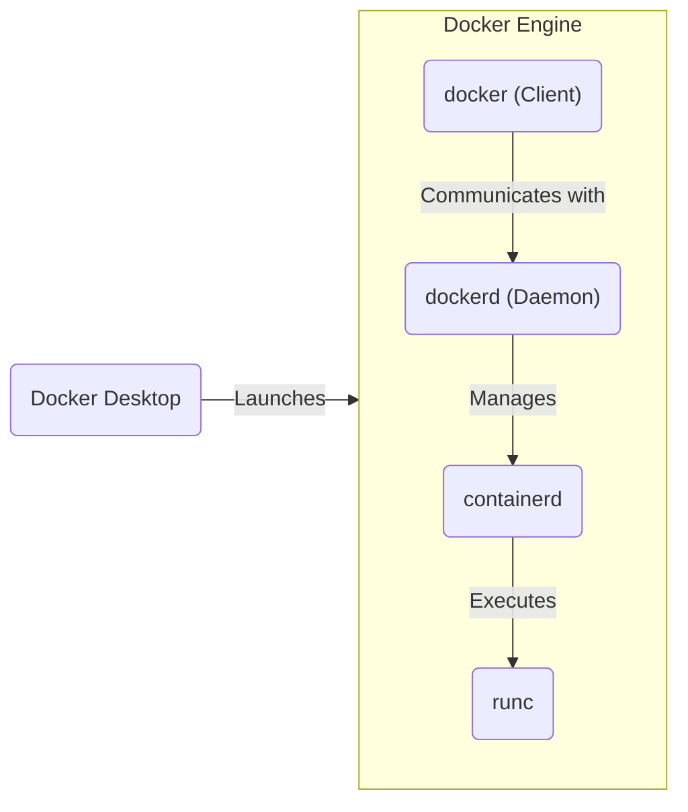

# Thinking like a Kubernetes

---
hideInToc: true

---

# Goals

* Demystify Kubernetes and containers
* Build foundational mental models

<svg width="400" viewBox="0 0 640 360" class="absolute right-100px bottom-50px">
  <path d="M 60 300 Q 200 300, 350 150, 500 2, 640 2"
        stroke="black" stroke-width="4" fill="none" />
  <rect fill="#F00" opacity="0.25" height="300" width="100" x="60" y="0"/>
  <text x="350" y="350" text-anchor="middle" font-size="12">Time</text>
  <text x="-150" y="40" text-anchor="middle" transform="rotate(-90)" font-size="12">Grasp</text>
</svg>

<!--
* Effort vs. grasp when learning a new subject
  * First, we struggle to grasp new information we encounter
    because we lack the vocabulary and mental models
    to connect the dots
  * Once we overcome this initial phase,
    we still encounter a lot of new information,
    but we now have the capacity to deeply understand it.
    This is when the real joy of learning kicks in,
    it’s the most rewarding period
  * Towards the end, there’s little left for us to learn,
    except the more technical/specialized/esoteric subfields
-->

---
hideInToc: true

---

# Non-Goals

* Actionable insights
* Passive learning
* A laid-back introduction

<!--
* We talk concepts, not CLI flags nor YAML schema
* Meant for those planning to work with Kubernetes soon, to adopt the right mindset for deeply understanding it
  * There's no magic, if you don’t apply it, you’ll forget it
* It’s okay if not everything clicks immediately
  * The concepts are mostly orthogonal, you can keep going even if some parts are unclear
  * As long as you understand the boundaries, you’ll be able to dig deeper a specific part as needed
-->

---
hideInToc: true

---

# Agenda

<Toc maxDepth="1" />

---
layout: section

---

# Introduction

---
level: 2

---

# Introduction – What’s Kubernetes?

<v-click>

* Production-Grade Container Scheduling and Management
  ([github](https://github.com/kubernetes/kubernetes))
* Kubernetes,
  also known as K8s,
  is an open source system for automating deployment,
  scaling,
  and management
  of containerized applications
  ([docs](https://kubernetes.io/))
</v-click>

---
level: 2

---

# Introduction – What’s really Kubernetes?

* > Kubernetes is a declarative API for building declarative APIs\
  > Kubernetes is a platform for building platforms\
  > Kubernetes is a datacenter OS\
  > Kubernetes is the standardized, low level, Cloud API
* [kcp](https://www.kcp.io/):
  Kubernetes-like control planes for form-factors and use-cases
  beyond Kubernetes and container workloads.
  That is, Kubernetes without the container management part

---
title: Introduction – Covered Topics
level: 2

---

<!--
* Concepts are built upon each other
* We'll only cover/mention highlighed topics
* We tackle Kubernetes from underneath,
  with a lower-level approach than usual
-->

---
layout: section

---

# OCI Containers

---
level: 2

---

# OCI Containers – What’s Docker?

* Docker Inc., a company (split up, sold, in trouble?)
* Many open source projects
  * Engine, Compose, Moby (containerd, runc, BuildKit, SwarmKit)
* Some proprietary products
  * Desktop, Hub, multiple cloud offerings
* > Some kind of lightweight VM
* A catch-all term to mean OCI

<!--
* The _lightweight VM_ analogy helped with adoption by developers,
but it quickly shows its limits
when we need to precisely understand what's going on,
e.g. to debug a distroless container
-->

---
level: 2

---

# OCI Containers – What is it, then?

* An OCI image is an artifact that packages an application
  together with all its dependencies.
  It defined by the [OCI image spec](https://github.com/opencontainers/image-spec)
* An OCI container is an environment for executing processes
  in an isolated, restricted, and consistent maner.
  It defined by the [OCI runtime spec](https://github.com/opencontainers/runtime-spec)
* The OCI specification defines containers for the following platforms:
  Linux, Solaris, Windows, Virtual-Machines, and z/OS.

Practically,

* An image is a filesystem archive
  plus some JSON metadata.
* A (Linux) container is a regular Linux process
  with some Linux features sprinkled on top:
  `chroot`, namespaces, and cgroups

---
layout: two-cols-header
layoutClass: layout
level: 2

---

# OCI Containers – Daemon and Runtime and Manager, oh my!

::left::

* High-level runtimes, aka container managers:
  [containerd](https://containerd.io/),
  [CRI-O](https://cri-o.io/),
  dockerd,
  [Podman](https://podman.io/)
* (Low-level) runtimes:
  [runc](https://github.com/opencontainers/runc),
  [crun](https://github.com/containers/crun),
  [youki](https://youki-dev.github.io/youki/),
  [runsc (gVisor)](https://gvisor.dev/),
  [Kata Containers](https://katacontainers.io/)
* For each daemon, a client: `docker`, `ctr`, `nerdctl`, `crictl`
* Most managers have abstracted away their relationship with runtimes
* _Spoiler: Kubernetes also abstracted away its relationship with runtimes/managers,
  with the [Container Runtime Interface (CRI)](https://kubernetes.io/docs/concepts/architecture/cri/)_

::right::

<!--
* Docker "layers"
  * runc:
    manage container lifecycle (create, start, exec, kill, delete),
    not a daemon
  * containerd:
    pull, push, and store images,
    supervise containers,
    low-level network and volume management,
    integration points (high-level APIs & plugins)
  * Docker:
    build images,
    provide orchestration features (Compose & Swarm),
    high-level network and volume management,
    higher-level CLI and API
  * Desktop:
    better packaging,
    lightweight VM to run Linux containers on Windows/macOS,
    one-click Kubernetes cluster,
    GUI
-->

---
level: 2

---

# OCI containers – Resources

* [Build containers the hard way](https://containers.gitbook.io/build-containers-the-hard-way/),
  like Kubernetes the Hard Way but for containers
* [Gocker](https://github.com/shuveb/containers-the-hard-way) (Go)
* [Bocker](https://github.com/p8952/bocker) (Bash)
* [Jérôme Petazzoni](https://www.youtube.com/watch?v=sK5i-N34im8) (Bash)
* Liz Rice ([1](https://www.youtube.com/watch?v=8fi7uSYlOdc) and [2](https://www.youtube.com/watch?v=_TsSmSu57Zo)) (Go)
* [Kévin Sztern's](https://octo.ubicast.tv/videos/sous-le-capot-dun-conteneur-implementons-notre-propre-docker-run/),
  and Thomas Pepiot’s ([1](https://octo.ubicast.tv/videos/under-the-hood-of-docker-containers-16-03-2017-152440-partie-1_73877/) and [2](https://octo.ubicast.tv/videos/under-the-hood-of-docker-containers-16-03-2017-152440-partie-2_73250/)) BoFs (private)
* [Dockerless](https://www.youtube.com/watch?v=Li3iWRRHgX8&list=PLozcbFx8FoPH30kYPbPuPsvxASWoLo9XB) playlist
* [Debunking Container Myths](https://iximiuz.com/en/series/debunking-container-myths/), and Ivan Velichko’s blog in general
