# Thinking like a Kubernetes

  <a href="https://github.com/ndrpnt/slides" target="_blank" class="slidev-icon-btn">
    <carbon-logo-github />
  </a>
  <a href="https://www.linkedin.com/in/ndrpnt" target="_blank" class="slidev-icon-btn">
    <carbon-logo-linkedin />
  </a>

---
hideInToc: true

---

# Goals

* Demystify Kubernetes and containers
* Build foundational mental models

<svg width="500" viewBox="0 0 640 360" v-click class="absolute right-100px bottom-35px">
  <rect height="300" width="100" x="60" y="0" fill="LightCoral" opacity="0.5"/>
  <path d="M 60 300 Q 200 300, 350 150, 500 2, 640 2"
        stroke="currentColor" stroke-width="4" fill="none"/>
  <text x="350" y="350" text-anchor="middle" font-size="12" fill="currentColor">Time</text>
  <text x="-150" y="40" text-anchor="middle" transform="rotate(-90)" font-size="12" fill="currentColor">Grasp</text>
</svg>

<!--
* Expect to tackle Kubernetes "from underneath",
  with a lower-level approach than usual
* Effort vs. grasp when learning a new subject
  * First, we struggle to grasp new information we encounter
    because we lack the vocabulary and mental models
    to connect the dots
  * Once we overcome this initial phase,
    we still encounter a lot of new information,
    but we now have the capacity to deeply understand it.
    This is when the real joy of learning kicks in,
    it’s the most rewarding period
  * Towards the end, there’s little left for us to learn,
    except the more technical/specialized/esoteric subfields
-->

---
hideInToc: true

---

# Non-Goals

* Actionable insights
* Passive learning
* A laid-back introduction

<!--
* We talk concepts, not CLI flags nor YAML schema
* Meant for those planning to work with Kubernetes soon, to adopt the right mindset for deeply understanding it
  * There's no magic, if you don’t apply it, you’ll forget it
* It’s okay if not everything clicks immediately
  * The concepts are mostly orthogonal, you can keep going even if some parts are unclear
  * As long as you understand the boundaries, you’ll be able to dig deeper a specific part as needed
-->

---
hideInToc: true

---

# Agenda

<Toc maxDepth="1" />

---
layout: section

---

# Introduction

---
level: 2

---

# Introduction – What’s Kubernetes?

<v-click>

* > Production-Grade Container Scheduling and Management
  > — [github](https://github.com/kubernetes/kubernetes)
* > Kubernetes,
  > also known as K8s,
  > is an open source system for automating deployment,
  > scaling,
  > and management
  > of containerized applications
  > — [docs](https://kubernetes.io/)
</v-click>

---
level: 2

---

# Introduction – What’s really Kubernetes?

* > Kubernetes is a declarative API for building declarative APIs
* > Kubernetes is a platform for building platforms
* > Kubernetes is a datacenter OS
* > Kubernetes is the standardized, low level, Cloud API
* [kcp](https://www.kcp.io/):
  Kubernetes-like control planes for form-factors and use-cases
  beyond Kubernetes and container workloads.
  That is, Kubernetes without the container management part

---
title: Introduction – Covered Topics
level: 2
hide: true

---

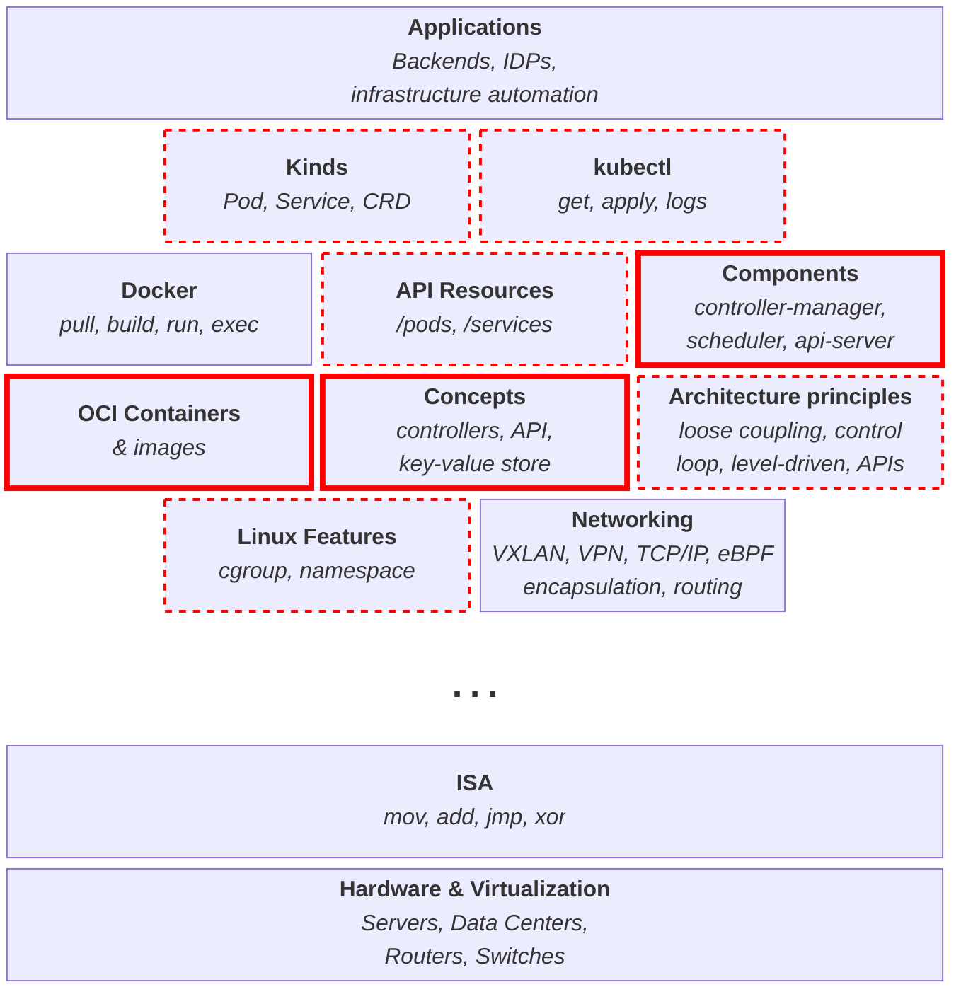

<!--
* Concepts are built upon each other
* We'll only cover/mention highlighed topics
-->

---
layout: section

---

# OCI Containers

<!--
* You can't talk about Kubernetes
  without first talking about containers
-->

---
level: 2

---

# OCI Containers – What’s Docker?

* Docker Inc., a company (split up, sold, in trouble?)
* Many open source projects
  * Engine, Compose, Moby (containerd, runc, BuildKit, SwarmKit)
* Some proprietary products
  * Desktop, Hub, multiple cloud offerings
* > Some kind of lightweight VM
* A catch-all term to mean OCI

<!--
* And you can't talk about containers
  without first demystifying Docker
* The _lightweight VM_ analogy helped with adoption by developers,
  but it quickly shows its limits
  when we need to precisely understand what's going on,
  e.g. to debug a distroless container
-->

---
level: 2

---

# OCI Containers – What is it, then?

* An OCI image is an artifact that packages an application
  together with all its dependencies.
  It defined by the [OCI image spec](https://github.com/opencontainers/image-spec)
* An OCI container is an environment for executing processes
  in an isolated, restricted, and consistent maner.
  It defined by the [OCI runtime spec](https://github.com/opencontainers/runtime-spec)
* The OCI specification defines containers for the following platforms:
  Linux, Solaris, Windows, Virtual-Machines, and z/OS.

Practically,

* An image is a filesystem archive
  plus some JSON metadata.
* A (Linux) container is a regular Linux process
  with some Linux features sprinkled on top:
  `chroot`, namespaces, and cgroups

<!--
* These are simplified definitions,
  with some shortcuts and little nuance
-->

---
layout: two-cols-header
layoutClass: OkyjSYcr
level: 2
hide: true

---

# OCI Containers – Daemon and Runtime and Manager, oh my!

::left::

* High-level runtimes, aka container managers:
  [containerd](https://containerd.io/),
  [CRI-O](https://cri-o.io/),
  dockerd,
  [Podman](https://podman.io/)
* (Low-level) runtimes:
  [runc](https://github.com/opencontainers/runc),
  [crun](https://github.com/containers/crun),
  [youki](https://youki-dev.github.io/youki/),
  [runsc (gVisor)](https://gvisor.dev/),
  [Kata Containers](https://katacontainers.io/)
* For each daemon, a client: `docker`, `ctr`, `nerdctl`, `crictl`
* Most managers have abstracted away their relationship with runtimes
* _Spoiler: Kubernetes also abstracted away its relationship with runtimes/managers,
  with the [Container Runtime Interface (CRI)](https://kubernetes.io/docs/concepts/architecture/cri/)_

::right::

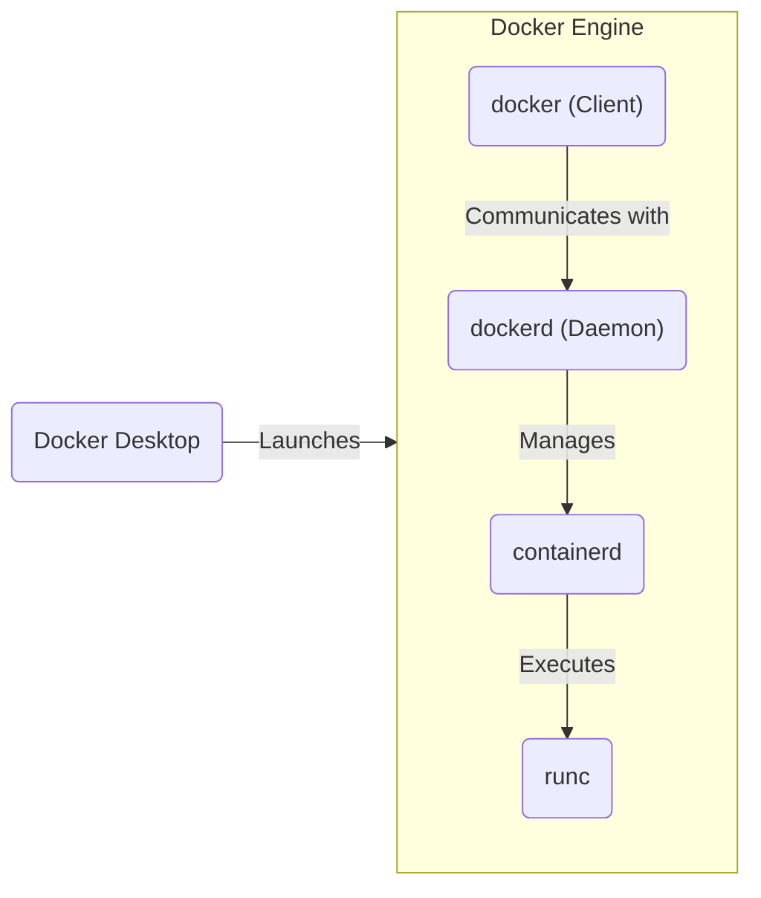

<!--
* **This slide is slightly off-topic,
  feel free to skip it**
* Docker "layers"
  * runc:
    manage container lifecycle (create, start, exec, kill, delete),
    CLI (not a daemon)
  * containerd:
    pull, push, and store images,
    supervise containers,
    low-level network and volume management,
    integration points (high-level APIs and plugins)
  * Docker:
    build images,
    provide orchestration features (Compose and Swarm),
    high-level network and volume management,
    higher-level CLI and API
  * Desktop:
    better packaging,
    lightweight VM to run Linux containers on Windows/macOS,
    one-click Kubernetes cluster,
    GUI
-->

---
level: 2
hide: true

---

# OCI containers – Resources

* [Build containers the hard way](https://containers.gitbook.io/build-containers-the-hard-way/),
  like Kubernetes the Hard Way but for containers
* [Gocker](https://github.com/shuveb/containers-the-hard-way) (Go)
* [Bocker](https://github.com/p8952/bocker) (Bash)
* [Jérôme Petazzoni](https://www.youtube.com/watch?v=sK5i-N34im8) (Bash)
* Liz Rice ([1](https://www.youtube.com/watch?v=8fi7uSYlOdc) and [2](https://www.youtube.com/watch?v=_TsSmSu57Zo)) (Go)
* [Kévin Sztern's](https://octo.ubicast.tv/videos/sous-le-capot-dun-conteneur-implementons-notre-propre-docker-run/),
  and Thomas Pepiot’s ([1](https://octo.ubicast.tv/videos/under-the-hood-of-docker-containers-16-03-2017-152440-partie-1_73877/) and [2](https://octo.ubicast.tv/videos/under-the-hood-of-docker-containers-16-03-2017-152440-partie-2_73250/)) BoFs (private)
* [Dockerless](https://www.youtube.com/watch?v=Li3iWRRHgX8&list=PLozcbFx8FoPH30kYPbPuPsvxASWoLo9XB) playlist
* [Debunking Container Myths](https://iximiuz.com/en/series/debunking-container-myths/), and Ivan Velichko’s blog in general

---
layout: section

---

# Kubernetes

---
level: 2

---

# Kubernetes – History

* Born at Google in 2014
* Built at the crossroads of
  * A decade of experience running containers at scale (Borg, Omega, cgroups, lmctfy)
  * Docker gaining traction, popularizing container usage
  * A strategic oportunity to catch up in the cloud race by leveraging OSS

<!--
* Reasonning at the application granularity,
  instead of the individual servers
  is self-evident for Googlers
-->

---
layout: two-cols-header
level: 2

---

# Kubernetes – Purpose

::left::

* Abstracts away the infrastructure
* Enable _properly_ managing many containerized workloads

::right::

* Workload variety
  (stateful, Windows, ML, batches, sidecars)
* Configuration management
  (environment variables, configuration files, flags, secrets)
* Service discovery
* Network communication and isolation
* Public exposition
  (routing, load balancing, rate limiting, TLS termination, DNS)
* Security
  (least privilege, multi-tenancy, isolation)
* Resource management
  (CPU/GPU cores, RAM/VRAM, storage, network, devices, …)
* Health and readiness management
* Telemetry collection and annotation
* Progressive deployment and rollback
* Vertical and horizontal (auto)scaling
* Scheduling constraints and priority
  (spread, affinity, contention, overprovisioning, QoS, cronjobs)
* Developpement and debug tooling
* Graceful startup and termination
* Infrastructure and own lifecycle management
  (installation, upgrades, observability, flexibility)
* Extensibility
* Consistent, high-quality APIs and configuration format
* Debugging facilities
* Authentication, authorization, audit
* Certificate management
* Backups and disaster recovery

<!--
* Expose heterogeneous infrastructure through a unified API
* Once we establish a standard
  for distributing and running applications
  in a portable and isolated manner (containers),
  the appeal of a layer
  for homogenization and orchestration becomes clear
* The original purpose closely matches the "official" descriptions
  * Container Scheduling and Management
  * System for automating deployment, scaling, and management of containerized applications
  * And also that "Datacenter OS" idea
* To _properly_ manage workloads,
  Kubernetes put lot of thought into…
-->

---
level: 2

---

# Kubernetes – Purpose (updated)

* These definitions held for a few years
* Kubernetes has since evolved into a lower-level,
  more general-purpose tool.
  It often serves as a building block
  to create higher-level platforms
* To fully grasp this new use,
  one needs to understand Kubernetes' design principles and components,
  and how they can be applied and combined
  to address a wide range of problems

<v-click>

Some examples include:

* Operators: leverage Kubernetes concepts
  to encode operational knowledge of complex, usually stateful, applications
  (deployment, upgrade, scaling, remediation, backups, …)
* OpenFaaS / Knative: serverless platforms
* Kubeflow: ML plateform
* Crossplane: map Kubernetes resources to external resources
* Cluster API: manage Kubernetes clusters
</v-click>

<!--
* Kubernetes' well-thought architecture attracted varied use cases,
  naturally pushing workload-specific logic into plugins
  while keeping the core generic.
* As plugin ecosystem expands,
  container orchestration becomes just one use case.
* That's were these definitions come in
  * Kubernetes is a declarative API for building declarative APIs
  * Kubernetes is a platform for building platforms
  * Kubernetes is the standardized, low level, Cloud API
  * kcp: Kubernetes-like control planes for form-factors and use-cases
    beyond Kubernetes and container workloads.
* Crossplane: like Terraform,
  except with Kubernetes resources instead of HCL.
* An operator exist for most database technology.
-->

---
layout: section

---

# Components

---
level: 2

---

# Components – Boundaries and Responsibilities

<!--
* https://kubernetes.io/docs/concepts/overview/components/
* https://kubernetes.io/docs/concepts/architecture/
-->

---
level: 2

---

# TODO

<v-switch>
  <template #1>

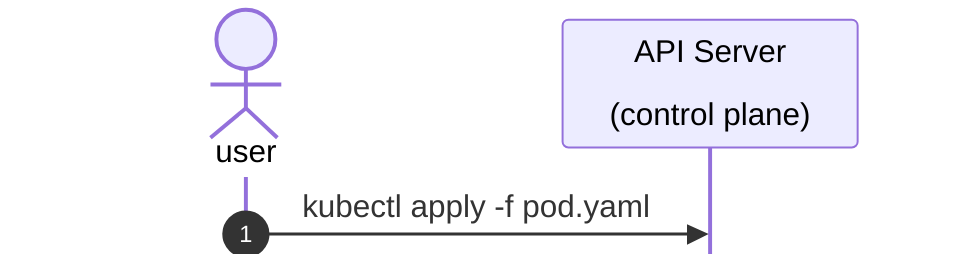

  </template>
  <template #2>

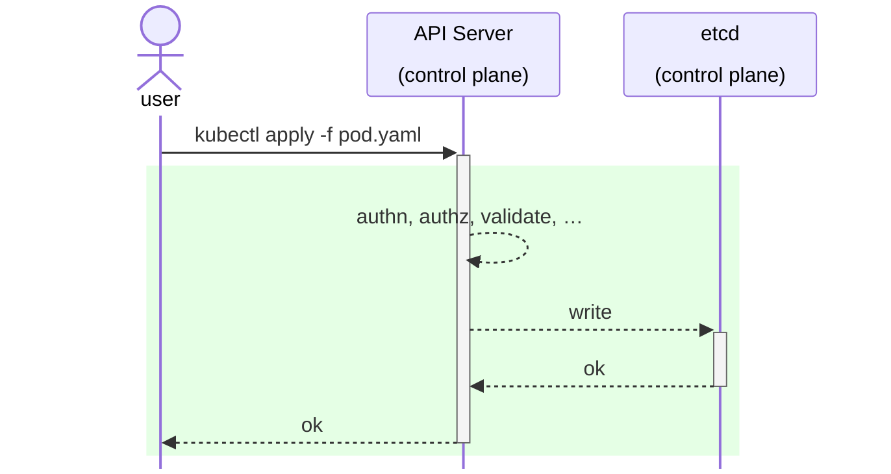

  </template>
  <template #3>

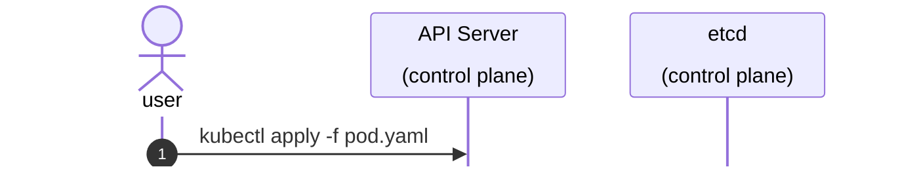

  </template>
  <template #4>

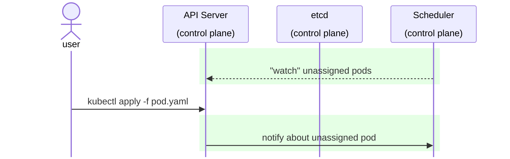

  </template>
  <template #5>

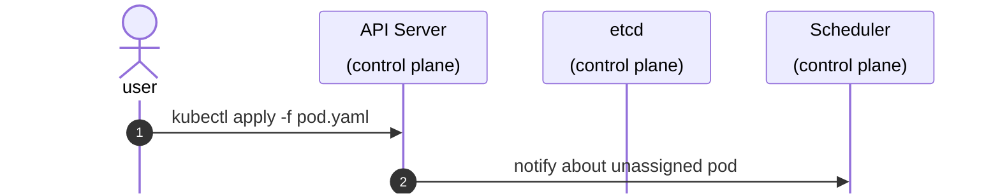

  </template>
  <template #6>

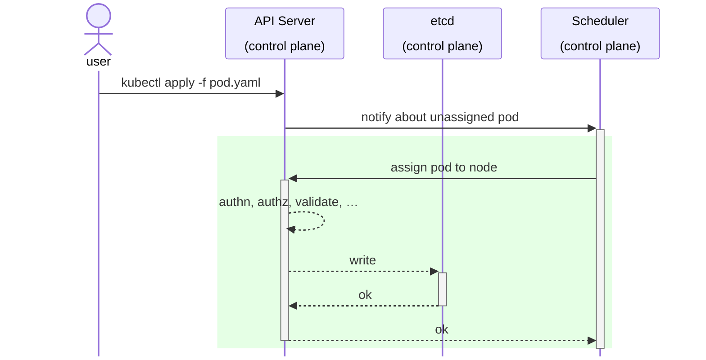

  </template>
  <template #7>

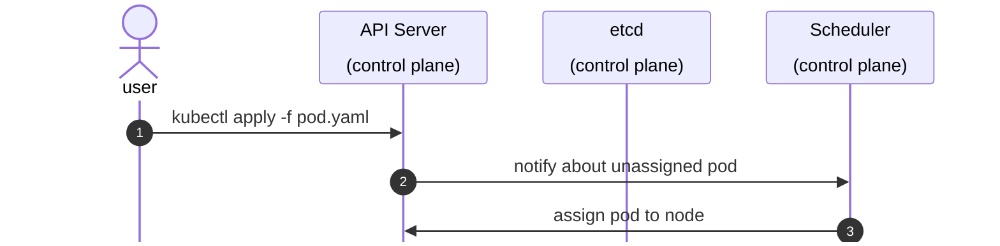

  </template>
  <template #8>

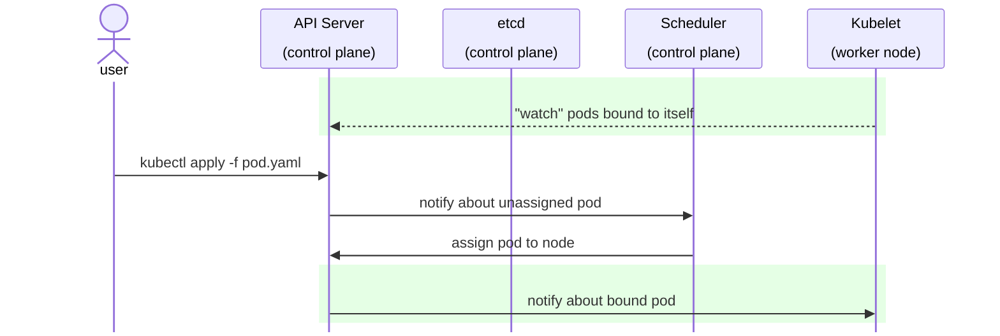

  </template>
  <template #9>

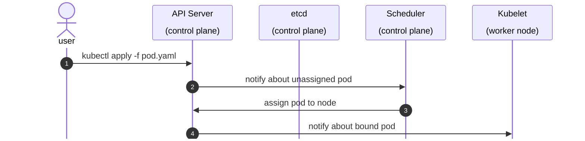

  </template>
  <template #10>

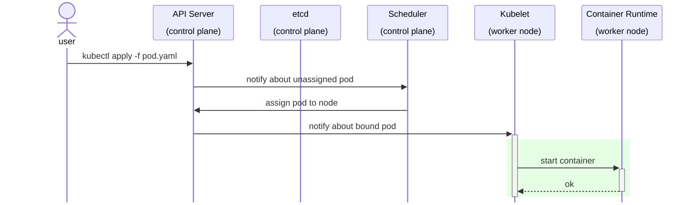

  </template>
  <template #11>

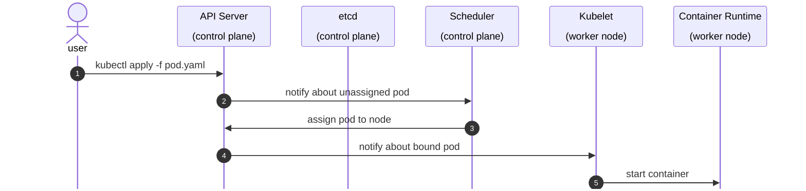

  </template>
  <template #12>

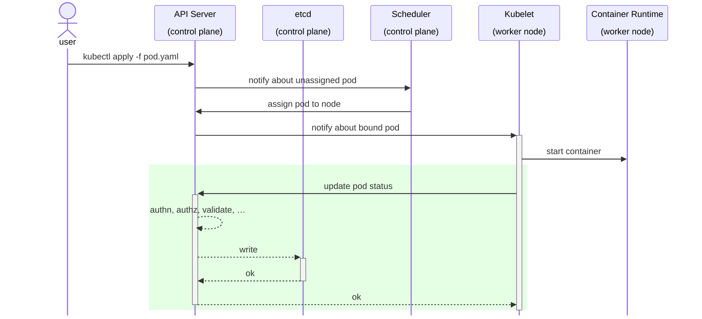

  </template>
  <template #13>

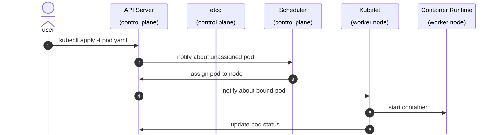

  </template>
</v-switch>

---
level: 2

---

# TODO 2

<v-switch>
  <template #1>

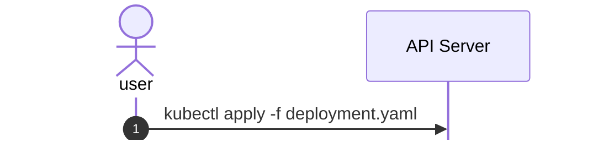

  </template>
  <template #2>

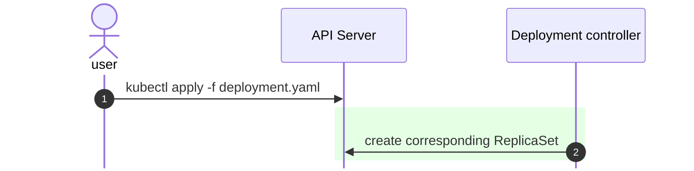

  </template>
  <template #3>

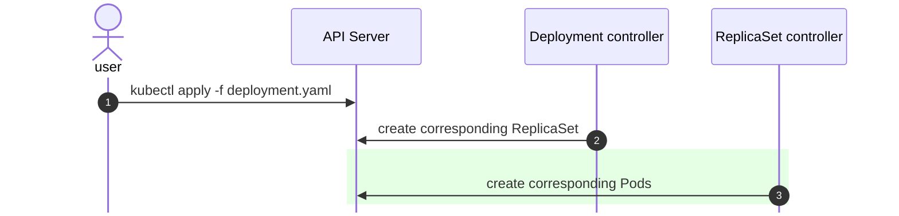

  </template>
  <template #4>

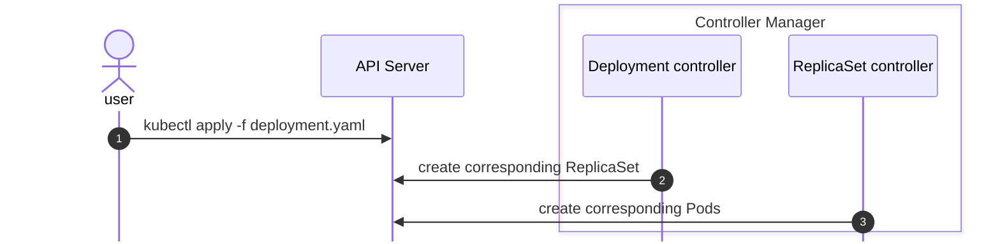

  </template>
</v-switch>
